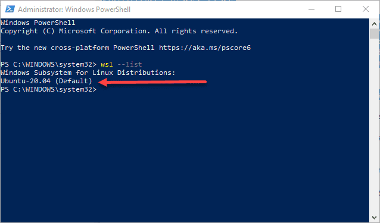
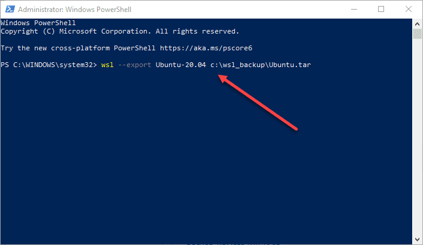

# WSL Commands

<aside>
💡 You have to make sure you are PowerShell to run these commands

</aside>

`**wsl --install**` — Install WSL and the Ubuntu distribution of Linux.

`**wsl --update**` — Manually update the version of your WSL Linux kernel. You can also use the command: `wsl --update rollback` to rollback to a previous version of the WSL Linux kernel.

`**wsl --shutdown` —** Immediately terminates all running distributions and the WSL 2 lightweight utility virtual machine. This command may be necessary in instances that require you to restart the WSL 2 virtual machine environment, such as [changing memory usage limits](https://docs.microsoft.com/en-us/windows/wsl/vhd-size) or making a change to your [.wslconfig file](https://docs.microsoft.com/en-us/windows/wsl/manage#).

`**wsl --install --distribution [Distribution Name]**` — Designate a distribution of Linux for installation besides the default (Ubuntu) by replacing `[Distribution Name]` with the name of the distribution. This command can also be entered as: `wsl -d [Distribution Name]` which logs you into the distro.

`**wsl --list --online**` — See a list of the Linux distributions available through the online store. This command can also be entered as: `wsl -l -o`.

`**wsl --set-version [distribution name] [versionNumber]**` — To designate the version of WSL (1 or 2) that a Linux distribution is running on, replace `[distribution name]` with the name of the distribution and replace `[versionNumber]` with 1 or 2. [Comparing WSL 1 and WSL 2](https://docs.microsoft.com/en-us/windows/wsl/compare-versions).

### **Comparing features**

| Feature | WSL 1 | WSL 2 |
| --- | --- | --- |
| Integration between Windows and Linux | ✅ | ✅ |
| Fast boot times | ✅ | ✅ |
| Small resource foot print compared to traditional Virtual Machines | ✅ | ✅ |
| Runs with current versions of VMware and VirtualBox | ✅ | ✅ |
| Managed VM | ❌ | ✅ |
| Full Linux Kernel | ❌ | ✅ |
| Full system call compatibility | ❌ | ✅ |
| Performance across OS file systems | ✅ | ❌ |

> As you can tell from the comparison table above, the WSL 2 architecture outperforms WSL 1 in several ways, with the exception of performance across OS file systems, which can be addressed by storing your project files on the same operating system as the tools you are running to work on the project.
> 

---

### Backup your WSL

`**wsl --shutdown` —** Make sure you shut-down your WSL distro

`**wsl --export [Image Name] [Export location file name.tar]`** — Run the export command to save your distro in the desired location.

Example Screenshot to check your distro

Example Screenshot to export to a backup folder

---